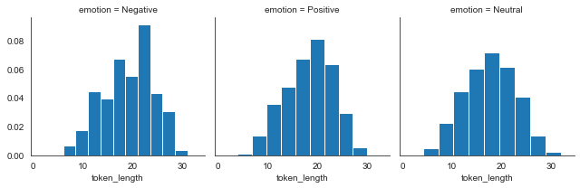
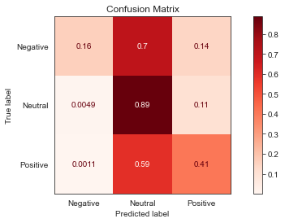
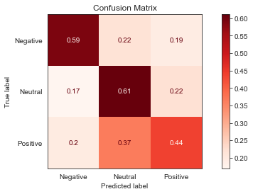

 - Student name: Steve Newman
 - Student pace: part time
 - Scheduled project review date/time: Tues. June 30 3:00 pm EST
 - Instructor name: James Irving PhD
 - Blog post URL:https://medium.com/p/a4baec51040b/edit

# NLP Sentiment Analysis Overview

The business case for this project was to identify negative sentiment tweets about brand specific products for the purpose of improving the brand's reputation. A Natural Language Processing model was deployed using various classifiers and Tfidf Vectorizers. The most significant metric used to evaluate performance was "Recall" specifically on the "Negative" class. 

A supervised learning method was used in which the training and test sets were labeled with a corresponding sentiment. An important caveat is that the models were optimized to identify negative sentiments. The results of neutral and positive sentiments were not considered for the success of the analysis.

# Methodology

Obtaining optimal results, consisted of the following method:
 - Import Packages and Functions
 - Exploratory Data Analysis (EDA)
 - Train/Test/Split
 - Test multiple classifiers in simple pipelines
 - Select a high performing pipeline and use balancing techniques to further optimize
 - Attempt to further improve model by employing a grid search of relevant parameters
 - Visualize results


```python
from IPython.display import clear_output
!pip install -U fsds_100719
clear_output()
from fsds_100719.imports import *

```


```python
import warnings
warnings.filterwarnings('ignore')
```

# Functions


```python
def evaluate_model(clf, y_trn, y_true, y_pred, X_trn, X_true):
    
    '''
    Calculates and displays the following: Train and Test Score, Classification Report, 
    and Confusion Matrix.
    
        Parameters:
            
            clf: classifier or instanciated model from run_model function
            y_trn: y train from test, train, split
            y_true: y test from test, train, split
            y_pred: y hat test from run_model fuction
            X_trn: X train from test, train, split
            X_true: X test from test, train, split
    
    '''
    # Calculates and displays train and test scores.
    train_score = clf.score(X_trn,y_trn)
    test_score = clf.score(X_true,y_true)
    print(f"Train score= {train_score}")
    print(f"Test score= {test_score}\n")
    
    # Displays Classification Report / Scores 
    print(metrics.classification_report(y_true,y_pred))
    
    # Displays Confusion Matrix
    fig, ax = plt.subplots(figsize=(10,4))
    metrics.plot_confusion_matrix(clf,X_true,y_true,cmap="Reds",
                                  normalize='true',ax=ax)
    ax.set(title='Confusion Matrix')
    ax.grid(False)
    
```

# EDA


```python
#Import data

data = pd.read_csv('product_review.csv',encoding= 'unicode_escape')
```


```python
data.head()
```


<div>
<style scoped>
    .dataframe tbody tr th:only-of-type {
        vertical-align: middle;
    }

    .dataframe tbody tr th {
        vertical-align: top;
    }

    .dataframe thead th {
        text-align: right;
    }
</style>
<table border="1" class="dataframe">
  <thead>
    <tr style="text-align: right;">
      <th></th>
      <th>tweet_text</th>
      <th>emotion_in_tweet_is_directed_at</th>
      <th>is_there_an_emotion_directed_at_a_brand_or_product</th>
    </tr>
  </thead>
  <tbody>
    <tr>
      <td>0</td>
      <td>.@wesley83 I have a 3G iPhone. After 3 hrs twe...</td>
      <td>iPhone</td>
      <td>Negative emotion</td>
    </tr>
    <tr>
      <td>1</td>
      <td>@jessedee Know about @fludapp ? Awesome iPad/i...</td>
      <td>iPad or iPhone App</td>
      <td>Positive emotion</td>
    </tr>
    <tr>
      <td>2</td>
      <td>@swonderlin Can not wait for #iPad 2 also. The...</td>
      <td>iPad</td>
      <td>Positive emotion</td>
    </tr>
    <tr>
      <td>3</td>
      <td>@sxsw I hope this year's festival isn't as cra...</td>
      <td>iPad or iPhone App</td>
      <td>Negative emotion</td>
    </tr>
    <tr>
      <td>4</td>
      <td>@sxtxstate great stuff on Fri #SXSW: Marissa M...</td>
      <td>Google</td>
      <td>Positive emotion</td>
    </tr>
  </tbody>
</table>
</div>


```python
# Rename columns for ease to work with.

data.rename(columns={'tweet_text': 'tweet', 'emotion_in_tweet_is_directed_at': 'product', 'is_there_an_emotion_directed_at_a_brand_or_product':'emotion'}, inplace=True)
```


```python
data.shape
```


    (9093, 3)


```python
data.info()
```

    <class 'pandas.core.frame.DataFrame'>
    RangeIndex: 9093 entries, 0 to 9092
    Data columns (total 3 columns):
    tweet      9092 non-null object
    product    3291 non-null object
    emotion    9093 non-null object
    dtypes: object(3)
    memory usage: 213.2+ KB


```python
# Most of the null data is in the product column.

data.isnull().sum()
```


    tweet         1
    product    5802
    emotion       0
    dtype: int64


```python
data.fillna('unknown', inplace=True)
```


```python
# Rename 'emotions' for ease to work with.

emotion_dict = dict({"No emotion toward brand or product":"Neutral",
                     "Positive emotion":"Positive", "Negative emotion":"Negative", 
                     "I can't tell":"I can't tell"})
```


```python
data['emotion'] = data['emotion'].map(emotion_dict)
```


```python
data['emotion'].value_counts()
```


    Neutral         5389
    Positive        2978
    Negative         570
    I can't tell     156
    Name: emotion, dtype: int64


```python
data.isnull().sum()
```


    tweet      0
    product    0
    emotion    0
    dtype: int64


```python
# Convert "tweet" data into string format.

data["tweet"]= data["tweet"].astype(str) 
```


```python
# Add "text length" feature.

data['text length'] = data['tweet'].apply(len)
```


```python
# Add "token length" feature.

data['token_length'] = [len(x.split(" ")) for x in data.tweet]
max(data.token_length)
```


    33


```python
data.isnull().sum()
```


    tweet           0
    product         0
    emotion         0
    text length     0
    token_length    0
    dtype: int64


```python
data.shape
```


    (9093, 5)


```python
# Identify target variables.

data['emotion'].value_counts()
```


    Neutral         5389
    Positive        2978
    Negative         570
    I can't tell     156
    Name: emotion, dtype: int64


```python
bad_rows = data['emotion']== "I can't tell"
```


```python
# Eliminate "I can't tell" variable.

data = data[~bad_rows]
```


```python
data['emotion'].value_counts()
```


    Neutral     5389
    Positive    2978
    Negative     570
    Name: emotion, dtype: int64


## Plot Numeric Features


```python
import matplotlib.pyplot as plt
import seaborn as sns
sns.set_style('white')
%matplotlib inline
```


```python
a = sns.FacetGrid(data,col='emotion')
a.map(plt.hist,'text length', density=True)
```


    <seaborn.axisgrid.FacetGrid at 0x1c198c17b8>


Plot shows similar distribution of "text length" across the three emotion types.


```python
token_l = sns.FacetGrid(data,col='emotion')
token_l.map(plt.hist,'token_length', density=True)
```


    <seaborn.axisgrid.FacetGrid at 0x1c1adfbef0>





Plot shows slightly more "tokens" are used in the negative emotion category versus the positive and neutral.


```python
sns.barplot(x='emotion',y='text length',data=data,palette='rainbow')
```


    <matplotlib.axes._subplots.AxesSubplot at 0x1c19e6e630>


Barplot shows a very slight increase of text length versus other sentiments.


```python
sns.countplot(x='emotion',data=data,palette='rainbow')
```


    <matplotlib.axes._subplots.AxesSubplot at 0x1c19eb4fd0>


The majority of the tweets indicated "neutral" or "no emotion" towards the brand and product. The negative emotion category is significantly lower than positive and neutral categories. Adjusting for the imbalance will likely be necessary for developing a predictive model.

# Train/Test/Split


```python
from sklearn.model_selection import train_test_split

X = data['tweet']
y = data['emotion']

X_train, X_test, y_train, y_test = train_test_split(X, y, stratify = y,test_size=0.30,
                                                    random_state=123)
```


```python
y_test.value_counts()
```


    Neutral     1617
    Positive     894
    Negative     171
    Name: emotion, dtype: int64


```python
y_train.value_counts()
```


    Neutral     3772
    Positive    2084
    Negative     399
    Name: emotion, dtype: int64


# LinearSVC


```python
from sklearn.pipeline import Pipeline
from sklearn.feature_extraction.text import TfidfVectorizer
from sklearn.svm import LinearSVC
from nltk import TweetTokenizer
```


```python
# Initialize the TweetTokenizer

tokenizer = TweetTokenizer(preserve_case=False)
```


```python
## Make a list of stopwords to remove
from nltk.corpus import stopwords
import string
```


```python
# Get all the stop words in the English language
stopwords_list = stopwords.words('english')
stopwords_list
```


    ['i',
     'me',
     'my',
     'myself',
     'we',
     'our',
     'ours',
     'ourselves',
     'you',
     "you're",
     "you've",
     "you'll",
     "you'd",
     'your',
     'yours',
     'yourself',
     'yourselves',
     'he',
     'him',
     'his',
     'himself',
     'she',
     "she's",
     'her',
     'hers',
     'herself',
     'it',
     "it's",
     'its',
     'itself',
     'they',
     'them',
     'their',
     'theirs',
     'themselves',
     'what',
     'which',
     'who',
     'whom',
     'this',
     'that',
     "that'll",
     'these',
     'those',
     'am',
     'is',
     'are',
     'was',
     'were',
     'be',
     'been',
     'being',
     'have',
     'has',
     'had',
     'having',
     'do',
     'does',
     'did',
     'doing',
     'a',
     'an',
     'the',
     'and',
     'but',
     'if',
     'or',
     'because',
     'as',
     'until',
     'while',
     'of',
     'at',
     'by',
     'for',
     'with',
     'about',
     'against',
     'between',
     'into',
     'through',
     'during',
     'before',
     'after',
     'above',
     'below',
     'to',
     'from',
     'up',
     'down',
     'in',
     'out',
     'on',
     'off',
     'over',
     'under',
     'again',
     'further',
     'then',
     'once',
     'here',
     'there',
     'when',
     'where',
     'why',
     'how',
     'all',
     'any',
     'both',
     'each',
     'few',
     'more',
     'most',
     'other',
     'some',
     'such',
     'no',
     'nor',
     'not',
     'only',
     'own',
     'same',
     'so',
     'than',
     'too',
     'very',
     's',
     't',
     'can',
     'will',
     'just',
     'don',
     "don't",
     'should',
     "should've",
     'now',
     'd',
     'll',
     'm',
     'o',
     're',
     've',
     'y',
     'ain',
     'aren',
     "aren't",
     'couldn',
     "couldn't",
     'didn',
     "didn't",
     'doesn',
     "doesn't",
     'hadn',
     "hadn't",
     'hasn',
     "hasn't",
     'haven',
     "haven't",
     'isn',
     "isn't",
     'ma',
     'mightn',
     "mightn't",
     'mustn',
     "mustn't",
     'needn',
     "needn't",
     'shan',
     "shan't",
     'shouldn',
     "shouldn't",
     'wasn',
     "wasn't",
     'weren',
     "weren't",
     'won',
     "won't",
     'wouldn',
     "wouldn't"]


```python
additional_words = ['“','”','...','``',"''",'’',"#sxsw",'link',"@mention","}",
                    "{","rt","today","austin","SWSW","sxsw","quot","mention","Google",
                    "Apple","iPhone", "iPad"]
```


```python
## Add punctuation to stopwords_list
stopwords_list+=string.punctuation
## Add additional_words to stopwords_list
stopwords_list.extend(additional_words)
stopwords_list
```


    ['i',
     'me',
     'my',
     'myself',
     'we',
     'our',
     'ours',
     'ourselves',
     'you',
     "you're",
     "you've",
     "you'll",
     "you'd",
     'your',
     'yours',
     'yourself',
     'yourselves',
     'he',
     'him',
     'his',
     'himself',
     'she',
     "she's",
     'her',
     'hers',
     'herself',
     'it',
     "it's",
     'its',
     'itself',
     'they',
     'them',
     'their',
     'theirs',
     'themselves',
     'what',
     'which',
     'who',
     'whom',
     'this',
     'that',
     "that'll",
     'these',
     'those',
     'am',
     'is',
     'are',
     'was',
     'were',
     'be',
     'been',
     'being',
     'have',
     'has',
     'had',
     'having',
     'do',
     'does',
     'did',
     'doing',
     'a',
     'an',
     'the',
     'and',
     'but',
     'if',
     'or',
     'because',
     'as',
     'until',
     'while',
     'of',
     'at',
     'by',
     'for',
     'with',
     'about',
     'against',
     'between',
     'into',
     'through',
     'during',
     'before',
     'after',
     'above',
     'below',
     'to',
     'from',
     'up',
     'down',
     'in',
     'out',
     'on',
     'off',
     'over',
     'under',
     'again',
     'further',
     'then',
     'once',
     'here',
     'there',
     'when',
     'where',
     'why',
     'how',
     'all',
     'any',
     'both',
     'each',
     'few',
     'more',
     'most',
     'other',
     'some',
     'such',
     'no',
     'nor',
     'not',
     'only',
     'own',
     'same',
     'so',
     'than',
     'too',
     'very',
     's',
     't',
     'can',
     'will',
     'just',
     'don',
     "don't",
     'should',
     "should've",
     'now',
     'd',
     'll',
     'm',
     'o',
     're',
     've',
     'y',
     'ain',
     'aren',
     "aren't",
     'couldn',
     "couldn't",
     'didn',
     "didn't",
     'doesn',
     "doesn't",
     'hadn',
     "hadn't",
     'hasn',
     "hasn't",
     'haven',
     "haven't",
     'isn',
     "isn't",
     'ma',
     'mightn',
     "mightn't",
     'mustn',
     "mustn't",
     'needn',
     "needn't",
     'shan',
     "shan't",
     'shouldn',
     "shouldn't",
     'wasn',
     "wasn't",
     'weren',
     "weren't",
     'won',
     "won't",
     'wouldn',
     "wouldn't",
     '!',
     '"',
     '#',
     '$',
     '%',
     '&',
     "'",
     '(',
     ')',
     '*',
     '+',
     ',',
     '-',
     '.',
     '/',
     ':',
     ';',
     '<',
     '=',
     '>',
     '?',
     '@',
     '[',
     '\\',
     ']',
     '^',
     '_',
     '`',
     '{',
     '|',
     '}',
     '~',
     '“',
     '”',
     '...',
     '``',
     "''",
     '’',
     '#sxsw',
     'link',
     '@mention',
     '}',
     '{',
     'rt',
     'today',
     'austin',
     'SWSW',
     'sxsw',
     'quot',
     'mention',
     'Google',
     'Apple',
     'iPhone',
     'iPad']


```python
linear_svc = Pipeline([('tfidf', TfidfVectorizer(lowercase=True, stop_words='english',
                                                 tokenizer=tokenizer.tokenize)),
                     ('clf', LinearSVC(class_weight='balanced'))])

linear_svc.fit(X_train, y_train)  
```


    Pipeline(memory=None,
             steps=[('tfidf',
                     TfidfVectorizer(analyzer='word', binary=False,
                                     decode_error='strict',
                                     dtype=<class 'numpy.float64'>,
                                     encoding='utf-8', input='content',
                                     lowercase=True, max_df=1.0, max_features=None,
                                     min_df=1, ngram_range=(1, 1), norm='l2',
                                     preprocessor=None, smooth_idf=True,
                                     stop_words='english', strip_accents=None,
                                     sublinear_tf=False,
                                     token_patt...
                                     tokenizer=<bound method TweetTokenizer.tokenize of <nltk.tokenize.casual.TweetTokenizer object at 0x1c1a09e908>>,
                                     use_idf=True, vocabulary=None)),
                    ('clf',
                     LinearSVC(C=1.0, class_weight='balanced', dual=True,
                               fit_intercept=True, intercept_scaling=1,
                               loss='squared_hinge', max_iter=1000,
                               multi_class='ovr', penalty='l2', random_state=None,
                               tol=0.0001, verbose=0))],
             verbose=False)


```python
predictions = linear_svc.predict(X_test)
```

## Metrics


```python
from sklearn import metrics

evaluate_model(linear_svc, y_train, y_test, predictions, X_train, X_test)
```

    Train score= 0.9322142286171063
    Test score= 0.6849366144668159
    
                  precision    recall  f1-score   support
    
        Negative       0.46      0.37      0.41       171
         Neutral       0.75      0.77      0.76      1617
        Positive       0.60      0.58      0.59       894
    
        accuracy                           0.68      2682
       macro avg       0.60      0.58      0.59      2682
    weighted avg       0.68      0.68      0.68      2682
    


LinearSVC provided a high training score and above average test score. Recall for the "Negative" class is .37, a first benchmark.

# MulitinomialNB


```python
from sklearn.naive_bayes import MultinomialNB
```


```python
text_mnb = Pipeline([('tfidf', TfidfVectorizer(lowercase=True, stop_words='english',
                                               tokenizer=tokenizer.tokenize)),
                     ('clf', MultinomialNB())])

# Feed the training data through the pipeline
text_mnb.fit(X_train, y_train)  
```


    Pipeline(memory=None,
             steps=[('tfidf',
                     TfidfVectorizer(analyzer='word', binary=False,
                                     decode_error='strict',
                                     dtype=<class 'numpy.float64'>,
                                     encoding='utf-8', input='content',
                                     lowercase=True, max_df=1.0, max_features=None,
                                     min_df=1, ngram_range=(1, 1), norm='l2',
                                     preprocessor=None, smooth_idf=True,
                                     stop_words='english', strip_accents=None,
                                     sublinear_tf=False,
                                     token_pattern='(?u)\\b\\w\\w+\\b',
                                     tokenizer=<bound method TweetTokenizer.tokenize of <nltk.tokenize.casual.TweetTokenizer object at 0x1c1a09e908>>,
                                     use_idf=True, vocabulary=None)),
                    ('clf',
                     MultinomialNB(alpha=1.0, class_prior=None, fit_prior=True))],
             verbose=False)


```python
predictions = text_mnb.predict(X_test)
```

## Metrics


```python
evaluate_model(text_mnb, y_train, y_test, predictions, X_train, X_test)
```

    Train score= 0.750599520383693
    Test score= 0.6528709917971663
    
                  precision    recall  f1-score   support
    
        Negative       1.00      0.01      0.01       171
         Neutral       0.64      0.97      0.77      1617
        Positive       0.74      0.21      0.33       894
    
        accuracy                           0.65      2682
       macro avg       0.79      0.39      0.37      2682
    weighted avg       0.70      0.65      0.58      2682
    


MultinomialNB showed dismal results for the "Negative" class.

# SGDClassifier


```python
from sklearn.linear_model import SGDClassifier
```


```python
text_sgdc = Pipeline([('tfidf', TfidfVectorizer(lowercase=True, stop_words='english',
                                                tokenizer=tokenizer.tokenize)),
                     ('clf', SGDClassifier())])


text_sgdc.fit(X_train, y_train)  
```


    Pipeline(memory=None,
             steps=[('tfidf',
                     TfidfVectorizer(analyzer='word', binary=False,
                                     decode_error='strict',
                                     dtype=<class 'numpy.float64'>,
                                     encoding='utf-8', input='content',
                                     lowercase=True, max_df=1.0, max_features=None,
                                     min_df=1, ngram_range=(1, 1), norm='l2',
                                     preprocessor=None, smooth_idf=True,
                                     stop_words='english', strip_accents=None,
                                     sublinear_tf=False,
                                     token_patt...
                     SGDClassifier(alpha=0.0001, average=False, class_weight=None,
                                   early_stopping=False, epsilon=0.1, eta0=0.0,
                                   fit_intercept=True, l1_ratio=0.15,
                                   learning_rate='optimal', loss='hinge',
                                   max_iter=1000, n_iter_no_change=5, n_jobs=None,
                                   penalty='l2', power_t=0.5, random_state=None,
                                   shuffle=True, tol=0.001, validation_fraction=0.1,
                                   verbose=0, warm_start=False))],
             verbose=False)


```python
predictions = text_sgdc.predict(X_test)
```

## Metrics


```python
evaluate_model(text_sgdc, y_train, y_test, predictions, X_train, X_test)
```

    Train score= 0.8954436450839328
    Test score= 0.6976137211036539
    
                  precision    recall  f1-score   support
    
        Negative       0.63      0.27      0.38       171
         Neutral       0.73      0.84      0.78      1617
        Positive       0.63      0.52      0.57       894
    
        accuracy                           0.70      2682
       macro avg       0.66      0.54      0.58      2682
    weighted avg       0.69      0.70      0.68      2682
    


Recall is .28; lower than previous results.

# LogisticRegression


```python
from sklearn.linear_model import LogisticRegression
```


```python
text_lr = Pipeline([('tfidf', TfidfVectorizer(lowercase=True, stop_words='english',
                                              tokenizer=tokenizer.tokenize)),
                     ('clf', LogisticRegression())])

text_lr.fit(X_train, y_train)  
```


    Pipeline(memory=None,
             steps=[('tfidf',
                     TfidfVectorizer(analyzer='word', binary=False,
                                     decode_error='strict',
                                     dtype=<class 'numpy.float64'>,
                                     encoding='utf-8', input='content',
                                     lowercase=True, max_df=1.0, max_features=None,
                                     min_df=1, ngram_range=(1, 1), norm='l2',
                                     preprocessor=None, smooth_idf=True,
                                     stop_words='english', strip_accents=None,
                                     sublinear_tf=False,
                                     token_patt...
                                     tokenizer=<bound method TweetTokenizer.tokenize of <nltk.tokenize.casual.TweetTokenizer object at 0x1c1a09e908>>,
                                     use_idf=True, vocabulary=None)),
                    ('clf',
                     LogisticRegression(C=1.0, class_weight=None, dual=False,
                                        fit_intercept=True, intercept_scaling=1,
                                        l1_ratio=None, max_iter=100,
                                        multi_class='auto', n_jobs=None,
                                        penalty='l2', random_state=None,
                                        solver='lbfgs', tol=0.0001, verbose=0,
                                        warm_start=False))],
             verbose=False)


```python
predictions = text_lr.predict(X_test)
```

## Metrics


```python
evaluate_model(text_lr, y_train, y_test, predictions, X_train, X_test)
```

    Train score= 0.8203037569944045
    Test score= 0.6987322893363161
    
                  precision    recall  f1-score   support
    
        Negative       0.63      0.07      0.13       171
         Neutral       0.71      0.88      0.79      1617
        Positive       0.65      0.49      0.56       894
    
        accuracy                           0.70      2682
       macro avg       0.67      0.48      0.49      2682
    weighted avg       0.69      0.70      0.67      2682
    


Logistic Regression also showing low recall results at 0.07.

# RandomForestClassifier


```python
from sklearn.ensemble import RandomForestClassifier
```


```python
text_rfc = Pipeline([('tfidf', TfidfVectorizer(lowercase=True, stop_words='english',
                                               tokenizer=tokenizer.tokenize)),
                     ('clf', RandomForestClassifier(class_weight='balanced'))])

text_rfc.fit(X_train, y_train)  
```


    Pipeline(memory=None,
             steps=[('tfidf',
                     TfidfVectorizer(analyzer='word', binary=False,
                                     decode_error='strict',
                                     dtype=<class 'numpy.float64'>,
                                     encoding='utf-8', input='content',
                                     lowercase=True, max_df=1.0, max_features=None,
                                     min_df=1, ngram_range=(1, 1), norm='l2',
                                     preprocessor=None, smooth_idf=True,
                                     stop_words='english', strip_accents=None,
                                     sublinear_tf=False,
                                     token_patt...
                     RandomForestClassifier(bootstrap=True, ccp_alpha=0.0,
                                            class_weight='balanced',
                                            criterion='gini', max_depth=None,
                                            max_features='auto',
                                            max_leaf_nodes=None, max_samples=None,
                                            min_impurity_decrease=0.0,
                                            min_impurity_split=None,
                                            min_samples_leaf=1, min_samples_split=2,
                                            min_weight_fraction_leaf=0.0,
                                            n_estimators=100, n_jobs=None,
                                            oob_score=False, random_state=None,
                                            verbose=0, warm_start=False))],
             verbose=False)


```python
predictions = text_rfc.predict(X_test)
```

## Metrics


```python
evaluate_model(text_rfc, y_train, y_test, predictions, X_train, X_test)
```

    Train score= 0.997761790567546
    Test score= 0.6812080536912751
    
                  precision    recall  f1-score   support
    
        Negative       0.75      0.16      0.26       171
         Neutral       0.69      0.89      0.78      1617
        Positive       0.65      0.41      0.50       894
    
        accuracy                           0.68      2682
       macro avg       0.70      0.48      0.51      2682
    weighted avg       0.68      0.68      0.65      2682
    





Random Forest showed a recall result about in the middle of the spectrum of all classifiers tried. This particular algorithm has proven successful in similar scenarios; I will further optimize it with over/under sampling techniques.

## Oversampling


```python
from imblearn.pipeline import make_pipeline
from imblearn.over_sampling import ADASYN, SMOTE, RandomOverSampler
from sklearn.model_selection import GridSearchCV

tfidf = TfidfVectorizer(lowercase=True, stop_words=stopwords_list,
                            tokenizer=tokenizer.tokenize)

rfc = RandomForestClassifier(class_weight='balanced')
```

# The under-sampling models significantly outperformed the over-sampling models. 

## RFC - RandomOverSampler


```python
ROS_pipeline = make_pipeline(tfidf, RandomOverSampler(random_state=123), rfc)
```


```python
ROS_pipeline.fit(X_train, y_train)  
```


    Pipeline(memory=None,
             steps=[('tfidfvectorizer',
                     TfidfVectorizer(analyzer='word', binary=False,
                                     decode_error='strict',
                                     dtype=<class 'numpy.float64'>,
                                     encoding='utf-8', input='content',
                                     lowercase=True, max_df=1.0, max_features=None,
                                     min_df=1, ngram_range=(1, 1), norm='l2',
                                     preprocessor=None, smooth_idf=True,
                                     stop_words=['i', 'me', 'my', 'myself', 'we',
                                                 'our', 'ours', 'ourse...
                     RandomForestClassifier(bootstrap=True, ccp_alpha=0.0,
                                            class_weight='balanced',
                                            criterion='gini', max_depth=None,
                                            max_features='auto',
                                            max_leaf_nodes=None, max_samples=None,
                                            min_impurity_decrease=0.0,
                                            min_impurity_split=None,
                                            min_samples_leaf=1, min_samples_split=2,
                                            min_weight_fraction_leaf=0.0,
                                            n_estimators=100, n_jobs=None,
                                            oob_score=False, random_state=None,
                                            verbose=0, warm_start=False))],
             verbose=False)


```python
predictions = ROS_pipeline.predict(X_test)
```

### Metrics


```python
evaluate_model(ROS_pipeline, y_train, y_test, predictions, X_train, X_test)
```

    Train score= 0.9646682653876898
    Test score= 0.6756152125279642
    
                  precision    recall  f1-score   support
    
        Negative       0.67      0.27      0.39       171
         Neutral       0.71      0.81      0.76      1617
        Positive       0.59      0.52      0.55       894
    
        accuracy                           0.68      2682
       macro avg       0.66      0.53      0.57      2682
    weighted avg       0.67      0.68      0.66      2682
    


## RFC - SMOTE


```python
SMOTE_pipeline = make_pipeline(tfidf, SMOTE(random_state=123),rfc)
SMOTE_pipeline.fit(X_train, y_train)  
```


    Pipeline(memory=None,
             steps=[('tfidfvectorizer',
                     TfidfVectorizer(analyzer='word', binary=False,
                                     decode_error='strict',
                                     dtype=<class 'numpy.float64'>,
                                     encoding='utf-8', input='content',
                                     lowercase=True, max_df=1.0, max_features=None,
                                     min_df=1, ngram_range=(1, 1), norm='l2',
                                     preprocessor=None, smooth_idf=True,
                                     stop_words=['i', 'me', 'my', 'myself', 'we',
                                                 'our', 'ours', 'ourse...
                     RandomForestClassifier(bootstrap=True, ccp_alpha=0.0,
                                            class_weight='balanced',
                                            criterion='gini', max_depth=None,
                                            max_features='auto',
                                            max_leaf_nodes=None, max_samples=None,
                                            min_impurity_decrease=0.0,
                                            min_impurity_split=None,
                                            min_samples_leaf=1, min_samples_split=2,
                                            min_weight_fraction_leaf=0.0,
                                            n_estimators=100, n_jobs=None,
                                            oob_score=False, random_state=None,
                                            verbose=0, warm_start=False))],
             verbose=False)


```python
predictions = SMOTE_pipeline.predict(X_test)
```

### Metrics


```python
evaluate_model(SMOTE_pipeline, y_train, y_test, predictions, X_train, X_test)
```

    Train score= 0.9653077537969624
    Test score= 0.6845637583892618
    
                  precision    recall  f1-score   support
    
        Negative       0.73      0.26      0.39       171
         Neutral       0.71      0.83      0.77      1617
        Positive       0.61      0.50      0.55       894
    
        accuracy                           0.68      2682
       macro avg       0.68      0.53      0.57      2682
    weighted avg       0.68      0.68      0.67      2682
    


## RFC - ADASYN


```python
ADASYN_pipeline = make_pipeline(tfidf, ADASYN(ratio='minority',random_state=123),rfc)
```


```python
ADASYN_pipeline.fit(X_train, y_train)  
```


    Pipeline(memory=None,
             steps=[('tfidfvectorizer',
                     TfidfVectorizer(analyzer='word', binary=False,
                                     decode_error='strict',
                                     dtype=<class 'numpy.float64'>,
                                     encoding='utf-8', input='content',
                                     lowercase=True, max_df=1.0, max_features=None,
                                     min_df=1, ngram_range=(1, 1), norm='l2',
                                     preprocessor=None, smooth_idf=True,
                                     stop_words=['i', 'me', 'my', 'myself', 'we',
                                                 'our', 'ours', 'ourse...
                     RandomForestClassifier(bootstrap=True, ccp_alpha=0.0,
                                            class_weight='balanced',
                                            criterion='gini', max_depth=None,
                                            max_features='auto',
                                            max_leaf_nodes=None, max_samples=None,
                                            min_impurity_decrease=0.0,
                                            min_impurity_split=None,
                                            min_samples_leaf=1, min_samples_split=2,
                                            min_weight_fraction_leaf=0.0,
                                            n_estimators=100, n_jobs=None,
                                            oob_score=False, random_state=None,
                                            verbose=0, warm_start=False))],
             verbose=False)


```python
predictions = ADASYN_pipeline.predict(X_test)
```

### Metrics


```python
evaluate_model(ADASYN_pipeline, y_train, y_test, predictions, X_train, X_test)
```

    Train score= 0.964828137490008
    Test score= 0.6838180462341537
    
                  precision    recall  f1-score   support
    
        Negative       0.72      0.29      0.41       171
         Neutral       0.70      0.85      0.77      1617
        Positive       0.63      0.46      0.53       894
    
        accuracy                           0.68      2682
       macro avg       0.68      0.53      0.57      2682
    weighted avg       0.68      0.68      0.67      2682
    


## Undersampling

## RFC Random Under Sampler


```python
from imblearn.under_sampling import NearMiss, RandomUnderSampler

RUS_pipeline = make_pipeline(tfidf, RandomUnderSampler(random_state=123),rfc)

```


```python
RUS_pipeline.fit(X_train, y_train)  
predictions = RUS_pipeline.predict(X_test)
```

### Metrics


```python
evaluate_model(RUS_pipeline, y_train, y_test, predictions, X_train, X_test)
```

    Train score= 0.6083133493205436
    Test score= 0.5395227442207308
    
                  precision    recall  f1-score   support
    
        Negative       0.16      0.60      0.26       171
         Neutral       0.75      0.58      0.66      1617
        Positive       0.50      0.45      0.47       894
    
        accuracy                           0.54      2682
       macro avg       0.47      0.54      0.46      2682
    weighted avg       0.63      0.54      0.57      2682
    


Random Under Sampler shows the best results so far at 0.71 recall. I tried a few variations of Near Miss to exahaust all possibilities.

## RFC - Near Miss 1


```python
NM1_pipeline = make_pipeline(tfidf, NearMiss(ratio='not minority',random_state=123, 
                                             version = 1),rfc)
NM1_pipeline.fit(X_train, y_train)  
```


    Pipeline(memory=None,
             steps=[('tfidfvectorizer',
                     TfidfVectorizer(analyzer='word', binary=False,
                                     decode_error='strict',
                                     dtype=<class 'numpy.float64'>,
                                     encoding='utf-8', input='content',
                                     lowercase=True, max_df=1.0, max_features=None,
                                     min_df=1, ngram_range=(1, 1), norm='l2',
                                     preprocessor=None, smooth_idf=True,
                                     stop_words=['i', 'me', 'my', 'myself', 'we',
                                                 'our', 'ours', 'ourse...
                     RandomForestClassifier(bootstrap=True, ccp_alpha=0.0,
                                            class_weight='balanced',
                                            criterion='gini', max_depth=None,
                                            max_features='auto',
                                            max_leaf_nodes=None, max_samples=None,
                                            min_impurity_decrease=0.0,
                                            min_impurity_split=None,
                                            min_samples_leaf=1, min_samples_split=2,
                                            min_weight_fraction_leaf=0.0,
                                            n_estimators=100, n_jobs=None,
                                            oob_score=False, random_state=None,
                                            verbose=0, warm_start=False))],
             verbose=False)


```python
predictions = NM1_pipeline.predict(X_test)
```

### Metrics


```python
evaluate_model(NM1_pipeline, y_train, y_test, predictions, X_train, X_test)
```

    Train score= 0.3317346123101519
    Test score= 0.3053691275167785
    
                  precision    recall  f1-score   support
    
        Negative       0.09      0.74      0.16       171
         Neutral       0.81      0.24      0.37      1617
        Positive       0.40      0.34      0.37       894
    
        accuracy                           0.31      2682
       macro avg       0.43      0.44      0.30      2682
    weighted avg       0.63      0.31      0.35      2682
    


A wonderful result of 0.80 recall on the negative class. Unsure if it's possible to improve further, I tested a grid search of the most relevant parameters.

## Extract Feature Importances


```python
importances = NM1_pipeline.named_steps['randomforestclassifier'].feature_importances_
```


```python
test = pd.DataFrame(importances)
```


```python
fn = NM1_pipeline.named_steps['tfidfvectorizer'].get_feature_names()
```


```python
len(fn)
```


    8934


```python
treedf = pd.Series(NM1_pipeline.named_steps['randomforestclassifier'].feature_importances_,
                      index=NM1_pipeline.named_steps['tfidfvectorizer'].get_feature_names())
```


```python
top_words = treedf.sort_values(ascending=False).head(10).index#.plot(kind='bar')
```


```python
#     '''
#     "For loop" cycling through top 10 feature importances words and placing them in a 
#     dictionary with the "word" as the the key and "value counts" as the value per class.
    
#     Returns DataFrame with "word" as index and normalized value counts for each class
#     where the "word" is present.
#     '''

word_dict={}
for word in top_words:
    
    word_df=data.copy()

    word_df["contains"] = word_df["tweet"].str.contains(word)

    emotions = ["Negative", "Neutral", "Positive"]

    emo_dict = {}
    for emo in emotions:
        emo_df = word_df.groupby("emotion").get_group(emo)
        emo_df["contains"].value_counts(normalize=True)
        emo_dict[emo] = emo_df["contains"].value_counts(normalize=True).loc[True]

    word_dict[word]= pd.Series(emo_dict, name=word)
```


```python
pd.DataFrame(word_dict).T
```


<div>
<style scoped>
    .dataframe tbody tr th:only-of-type {
        vertical-align: middle;
    }

    .dataframe tbody tr th {
        vertical-align: top;
    }

    .dataframe thead th {
        text-align: right;
    }
</style>
<table border="1" class="dataframe">
  <thead>
    <tr style="text-align: right;">
      <th></th>
      <th>Negative</th>
      <th>Neutral</th>
      <th>Positive</th>
    </tr>
  </thead>
  <tbody>
    <tr>
      <td>store</td>
      <td>0.057895</td>
      <td>0.115235</td>
      <td>0.140363</td>
    </tr>
    <tr>
      <td>new</td>
      <td>0.085965</td>
      <td>0.079050</td>
      <td>0.095702</td>
    </tr>
    <tr>
      <td>apple</td>
      <td>0.033333</td>
      <td>0.038597</td>
      <td>0.065480</td>
    </tr>
    <tr>
      <td>network</td>
      <td>0.014035</td>
      <td>0.023938</td>
      <td>0.011081</td>
    </tr>
    <tr>
      <td>google</td>
      <td>0.040351</td>
      <td>0.056040</td>
      <td>0.050705</td>
    </tr>
    <tr>
      <td>social</td>
      <td>0.036842</td>
      <td>0.039711</td>
      <td>0.020819</td>
    </tr>
    <tr>
      <td>major</td>
      <td>0.005263</td>
      <td>0.005196</td>
      <td>0.003022</td>
    </tr>
    <tr>
      <td>launch</td>
      <td>0.033333</td>
      <td>0.059751</td>
      <td>0.045668</td>
    </tr>
    <tr>
      <td>circles</td>
      <td>0.003509</td>
      <td>0.010763</td>
      <td>0.004701</td>
    </tr>
    <tr>
      <td>ipad</td>
      <td>0.040351</td>
      <td>0.046020</td>
      <td>0.058093</td>
    </tr>
  </tbody>
</table>
</div>


DataFrame with top ten feature importances are the index and normalized value counts for  each class where the "word" is present.

## Grid_RFC - Near Miss 1


```python
params = {'randomforestclassifier__criterion':['gini','entropy'],
             'randomforestclassifier__max_depth':[None, 5, 3, 10],
             'randomforestclassifier__min_samples_leaf': [1,2,3],
         'randomforestclassifier__max_features':['auto','sqrt',3,5,10,30,70]}

```


```python
NM1_pipeline = make_pipeline(tfidf, NearMiss(ratio='not minority',random_state=123, 
                                             version = 1),rfc)
```


```python
 
grid = GridSearchCV(NM1_pipeline, cv=5, n_jobs=-1, param_grid=params ,
                    scoring='recall_macro')
```


```python
grid.fit(X_train, y_train)
```


    ---------------------------------------------------------------------------

    KeyboardInterrupt                         Traceback (most recent call last)

    <ipython-input-127-3949096c802a> in <module>
    ----> 1 grid.fit(X_train, y_train)
    

    ~/anaconda3/envs/learn-env/lib/python3.6/site-packages/sklearn/model_selection/_search.py in fit(self, X, y, groups, **fit_params)
        708                 return results
        709 
    --> 710             self._run_search(evaluate_candidates)
        711 
        712         # For multi-metric evaluation, store the best_index_, best_params_ and


    ~/anaconda3/envs/learn-env/lib/python3.6/site-packages/sklearn/model_selection/_search.py in _run_search(self, evaluate_candidates)
       1149     def _run_search(self, evaluate_candidates):
       1150         """Search all candidates in param_grid"""
    -> 1151         evaluate_candidates(ParameterGrid(self.param_grid))
       1152 
       1153 


    ~/anaconda3/envs/learn-env/lib/python3.6/site-packages/sklearn/model_selection/_search.py in evaluate_candidates(candidate_params)
        687                                for parameters, (train, test)
        688                                in product(candidate_params,
    --> 689                                           cv.split(X, y, groups)))
        690 
        691                 if len(out) < 1:


    ~/anaconda3/envs/learn-env/lib/python3.6/site-packages/joblib/parallel.py in __call__(self, iterable)
        932 
        933             with self._backend.retrieval_context():
    --> 934                 self.retrieve()
        935             # Make sure that we get a last message telling us we are done
        936             elapsed_time = time.time() - self._start_time


    ~/anaconda3/envs/learn-env/lib/python3.6/site-packages/joblib/parallel.py in retrieve(self)
        831             try:
        832                 if getattr(self._backend, 'supports_timeout', False):
    --> 833                     self._output.extend(job.get(timeout=self.timeout))
        834                 else:
        835                     self._output.extend(job.get())


    ~/anaconda3/envs/learn-env/lib/python3.6/site-packages/joblib/_parallel_backends.py in wrap_future_result(future, timeout)
        519         AsyncResults.get from multiprocessing."""
        520         try:
    --> 521             return future.result(timeout=timeout)
        522         except LokyTimeoutError:
        523             raise TimeoutError()


    ~/anaconda3/envs/learn-env/lib/python3.6/concurrent/futures/_base.py in result(self, timeout)
        425                 return self.__get_result()
        426 
    --> 427             self._condition.wait(timeout)
        428 
        429             if self._state in [CANCELLED, CANCELLED_AND_NOTIFIED]:


    ~/anaconda3/envs/learn-env/lib/python3.6/threading.py in wait(self, timeout)
        293         try:    # restore state no matter what (e.g., KeyboardInterrupt)
        294             if timeout is None:
    --> 295                 waiter.acquire()
        296                 gotit = True
        297             else:


    KeyboardInterrupt: 


```python
grid.score(X_test, y_test)
```


```python
grid.best_params_
```

Research best estimator from grid


```python
best_pipe = grid.best_estimator_
```


```python
best_pipe
```


```python
best_pipe.fit(X_train,y_train)
```


```python
predictions = best_pipe.predict(X_test)
```

### Metrics


```python
evaluate_model(best_pipe, y_train, y_test, predictions, X_train, X_test)
```

Unfortunately, the grid search did not prove to be effective for further optimization as is evident by the .07 drop in recall.

## RFC - Near Miss 2


```python
NM2_pipeline = make_pipeline(tfidf, NearMiss(ratio='not minority',random_state=123,
                                             version = 2),rfc)
NM2_pipeline.fit(X_train, y_train)  
```


    Pipeline(memory=None,
             steps=[('tfidfvectorizer',
                     TfidfVectorizer(analyzer='word', binary=False,
                                     decode_error='strict',
                                     dtype=<class 'numpy.float64'>,
                                     encoding='utf-8', input='content',
                                     lowercase=True, max_df=1.0, max_features=None,
                                     min_df=1, ngram_range=(1, 1), norm='l2',
                                     preprocessor=None, smooth_idf=True,
                                     stop_words=['i', 'me', 'my', 'myself', 'we',
                                                 'our', 'ours', 'ourse...
                     RandomForestClassifier(bootstrap=True, ccp_alpha=0.0,
                                            class_weight='balanced',
                                            criterion='gini', max_depth=None,
                                            max_features='auto',
                                            max_leaf_nodes=None, max_samples=None,
                                            min_impurity_decrease=0.0,
                                            min_impurity_split=None,
                                            min_samples_leaf=1, min_samples_split=2,
                                            min_weight_fraction_leaf=0.0,
                                            n_estimators=100, n_jobs=None,
                                            oob_score=False, random_state=None,
                                            verbose=0, warm_start=False))],
             verbose=False)


```python
predictions = NM2_pipeline.predict(X_test)
```

### Metrics


```python
evaluate_model(NM2_pipeline, y_train, y_test, predictions, X_train, X_test)
```

    Train score= 0.6258992805755396
    Test score= 0.551826994780015
    
                  precision    recall  f1-score   support
    
        Negative       0.18      0.59      0.28       171
         Neutral       0.73      0.61      0.67      1617
        Positive       0.50      0.44      0.47       894
    
        accuracy                           0.55      2682
       macro avg       0.47      0.55      0.47      2682
    weighted avg       0.62      0.55      0.57      2682
    





## RFC - Near Miss 3


```python
NM3_pipeline = make_pipeline(tfidf, NearMiss(ratio='not minority',random_state=123,
                                             version = 3, n_neighbors_ver3=4),rfc)
NM3_pipeline.fit(X_train, y_train)
```


    Pipeline(memory=None,
             steps=[('tfidfvectorizer',
                     TfidfVectorizer(analyzer='word', binary=False,
                                     decode_error='strict',
                                     dtype=<class 'numpy.float64'>,
                                     encoding='utf-8', input='content',
                                     lowercase=True, max_df=1.0, max_features=None,
                                     min_df=1, ngram_range=(1, 1), norm='l2',
                                     preprocessor=None, smooth_idf=True,
                                     stop_words=['i', 'me', 'my', 'myself', 'we',
                                                 'our', 'ours', 'ourse...
                     RandomForestClassifier(bootstrap=True, ccp_alpha=0.0,
                                            class_weight='balanced',
                                            criterion='gini', max_depth=None,
                                            max_features='auto',
                                            max_leaf_nodes=None, max_samples=None,
                                            min_impurity_decrease=0.0,
                                            min_impurity_split=None,
                                            min_samples_leaf=1, min_samples_split=2,
                                            min_weight_fraction_leaf=0.0,
                                            n_estimators=100, n_jobs=None,
                                            oob_score=False, random_state=None,
                                            verbose=0, warm_start=False))],
             verbose=False)


```python
predictions = NM3_pipeline.predict(X_test)
```

### Metrics


```python
evaluate_model(NM3_pipeline, y_train, y_test, predictions, X_train, X_test)
```

    Train score= 0.5918465227817746
    Test score= 0.5432513049962714
    
                  precision    recall  f1-score   support
    
        Negative       0.15      0.58      0.24       171
         Neutral       0.73      0.59      0.65      1617
        Positive       0.55      0.45      0.49       894
    
        accuracy                           0.54      2682
       macro avg       0.48      0.54      0.46      2682
    weighted avg       0.63      0.54      0.57      2682
    


# Visualizations


```python
from wordcloud import WordCloud
```


```python
wcdata = data['emotion']== "Negative"
wcdata_pos = data['emotion']== "Positive"
```


```python
pd.set_option('display.max_colwidth', 10000)
data[wcdata_pos].head()
```


<div>
<style scoped>
    .dataframe tbody tr th:only-of-type {
        vertical-align: middle;
    }

    .dataframe tbody tr th {
        vertical-align: top;
    }

    .dataframe thead th {
        text-align: right;
    }
</style>
<table border="1" class="dataframe">
  <thead>
    <tr style="text-align: right;">
      <th></th>
      <th>tweet</th>
      <th>product</th>
      <th>emotion</th>
      <th>text length</th>
      <th>token_length</th>
    </tr>
  </thead>
  <tbody>
    <tr>
      <td>1</td>
      <td>@jessedee Know about @fludapp ? Awesome iPad/iPhone app that you'll likely appreciate for its design. Also, they're giving free Ts at #SXSW</td>
      <td>iPad or iPhone App</td>
      <td>Positive</td>
      <td>139</td>
      <td>22</td>
    </tr>
    <tr>
      <td>2</td>
      <td>@swonderlin Can not wait for #iPad 2 also. They should sale them down at #SXSW.</td>
      <td>iPad</td>
      <td>Positive</td>
      <td>79</td>
      <td>15</td>
    </tr>
    <tr>
      <td>4</td>
      <td>@sxtxstate great stuff on Fri #SXSW: Marissa Mayer (Google), Tim O'Reilly (tech books/conferences) &amp;amp; Matt Mullenweg (Wordpress)</td>
      <td>Google</td>
      <td>Positive</td>
      <td>131</td>
      <td>17</td>
    </tr>
    <tr>
      <td>7</td>
      <td>#SXSW is just starting, #CTIA is around the corner and #googleio is only a hop skip and a jump from there, good time to be an #android fan</td>
      <td>Android</td>
      <td>Positive</td>
      <td>138</td>
      <td>28</td>
    </tr>
    <tr>
      <td>8</td>
      <td>Beautifully smart and simple idea RT @madebymany @thenextweb wrote about our #hollergram iPad app for #sxsw! http://bit.ly/ieaVOB</td>
      <td>iPad or iPhone App</td>
      <td>Positive</td>
      <td>129</td>
      <td>17</td>
    </tr>
  </tbody>
</table>
</div>


An example of negative tweets.


```python
wordcloud = WordCloud(stopwords=stopwords_list, background_color="white", max_words=100, 
                      contour_width=3, 
                      contour_color='steelblue')

wordcloud.generate(data[wcdata]['tweet'].to_string())

wordcloud.to_image()
```


The most popular words to appear in the negative tweets.


```python
wordcloud.generate(data[wcdata_pos]['tweet'].to_string())

wordcloud.to_image()
```


The most popular words to appear in the positive tweets.

# Conclusion

After exploring multiple classifiers and balancing techniques, the Random Forest model with the first variation of Near Miss performed best with a recall of 0.80. The words identified as contributing to optimize this model were not necessarily words that action could be taken on for example, "social", "new", and "store". The power of the model to identify slight differences of the presence of words among the three classifications is evident by how closely their presence was in each class. For example, the word "launch" showed up in 0.03% of negative tweets, 0.06% of neutral tweets and 0.04% of positive tweets. This sensitivity was evident across the most important words contributing to the model.

# Recommendations

Brand managers and product developers might want to review the negative tweets such as:

".@wesley83 I have a 3G iPhone. After 3 hrs tweeting at #RISE_Austin, it was dead! I need to upgrade. Plugin stations at #SXSW."

"@sxsw I hope this year's festival isn't as crashy as this year's iPhone app. #sxsw"

"@mention - False Alarm: Google Circles Not Coming Now‰ÛÒand Probably Not Ever? - {link} #Google #Circles #Social #SXSW"

Addressing the concerns of product users will go a long way to improve products and brand reputation which in turn will make the business more successful.

Lastly, developing a campaign with improvements made and promoting it across multiple channels will make a big impact on brand reputation and users impressions.
